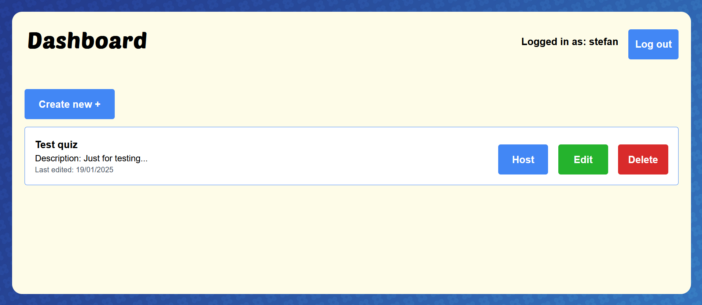
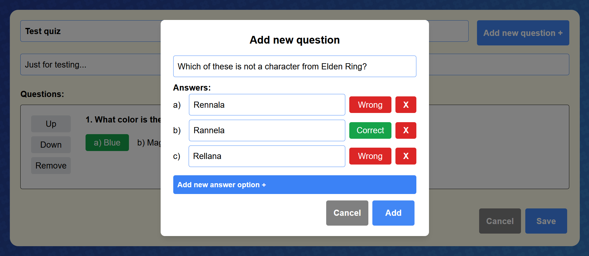

# TriviaPenguin.com

TriviaPenguin is a webapp where users can create quizzes and play them in real-time with others.

It can be accessed on [triviapenguin.com](https://www.triviapenguin.com/)

If you want to run it locally:
* clone repo
* get ssl/tls certificates (self signed is fine for local development)
* modify nginx.conf to point to these certificates (alternatively you can also modify nginx.conf to not use ssl at all, in which case you dont need certificates)
* create a .env in project root dir (see docker-compose.yaml for what variables you need)  
* run docker compose up in project root dir

## Tech stack:
* frontend: Angular + Tailwind
* backend: Spring Boot
* database: PostgreSQL
* server config: nginx

## Screenshots:

